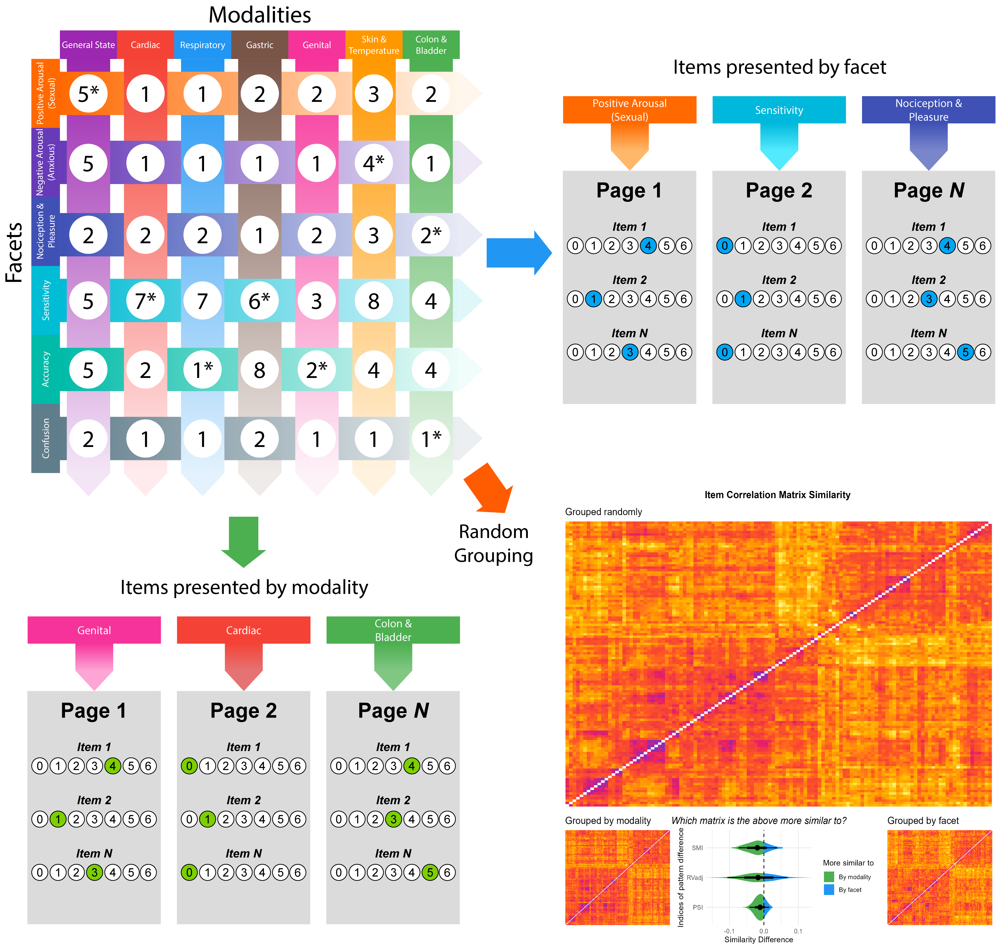
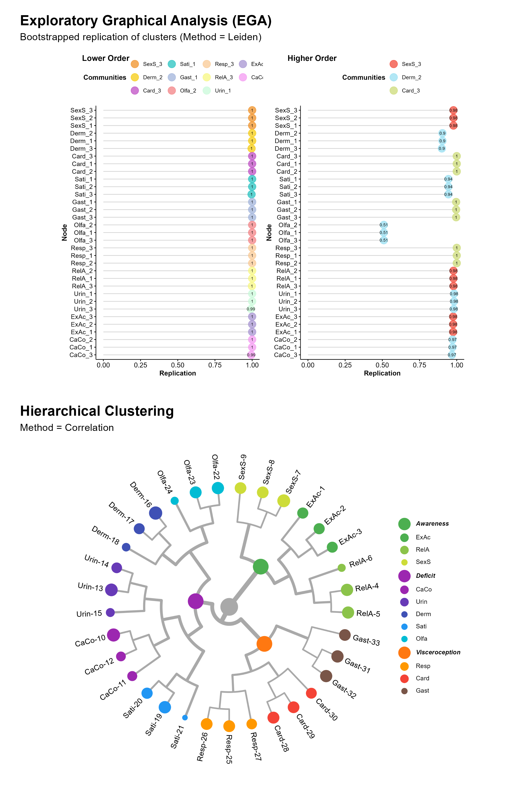
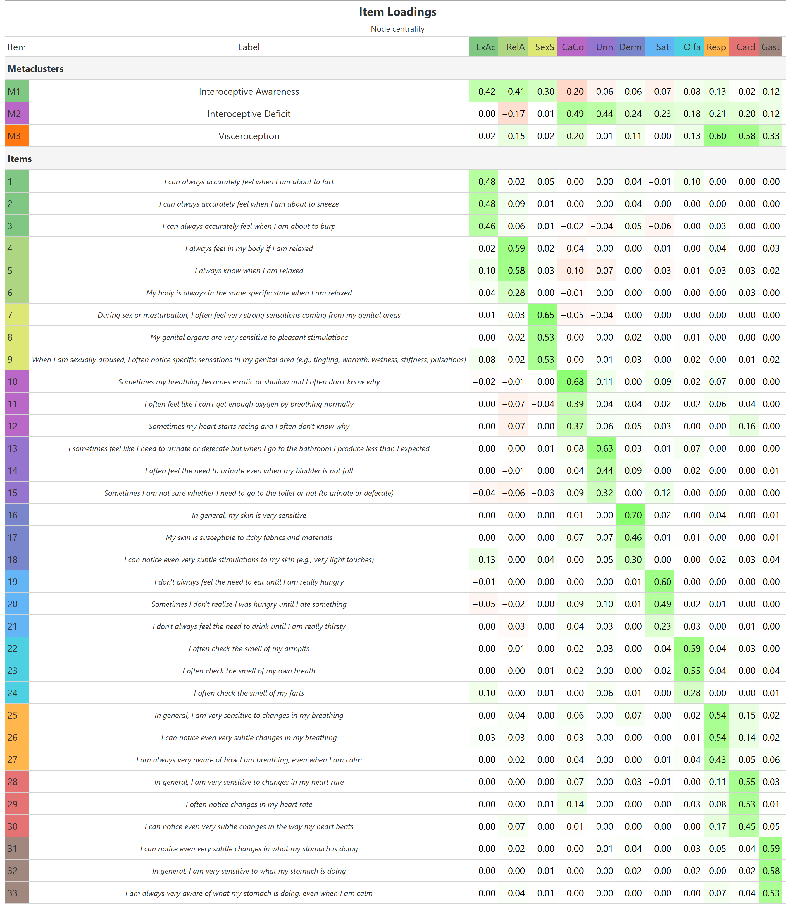
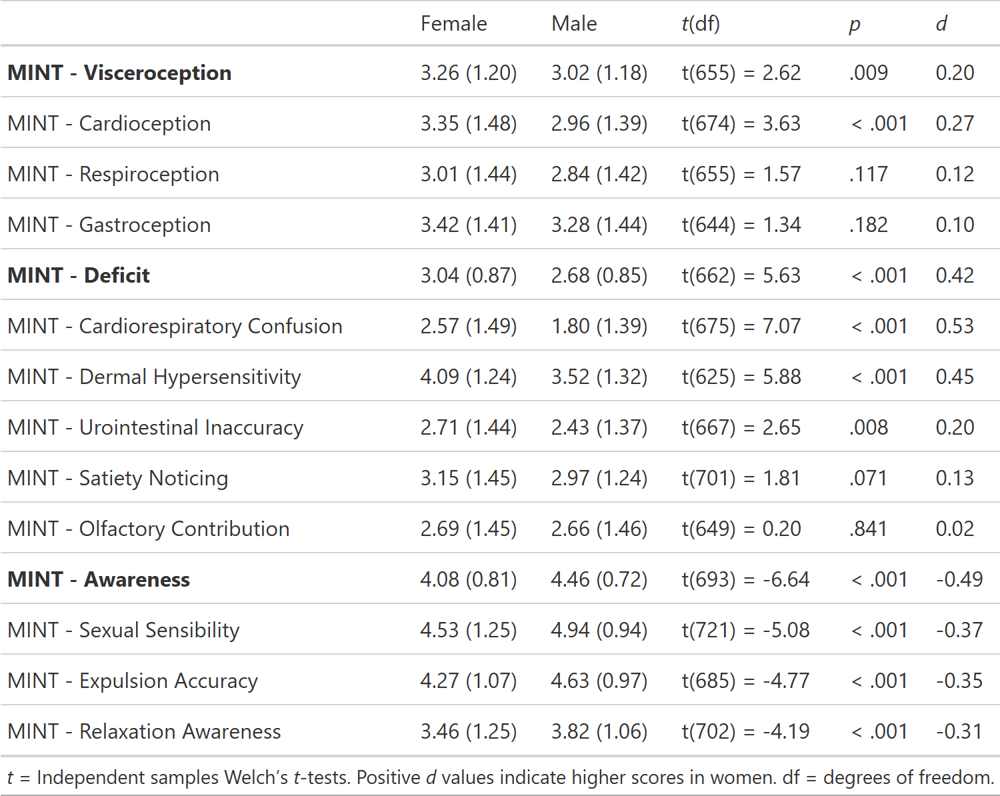
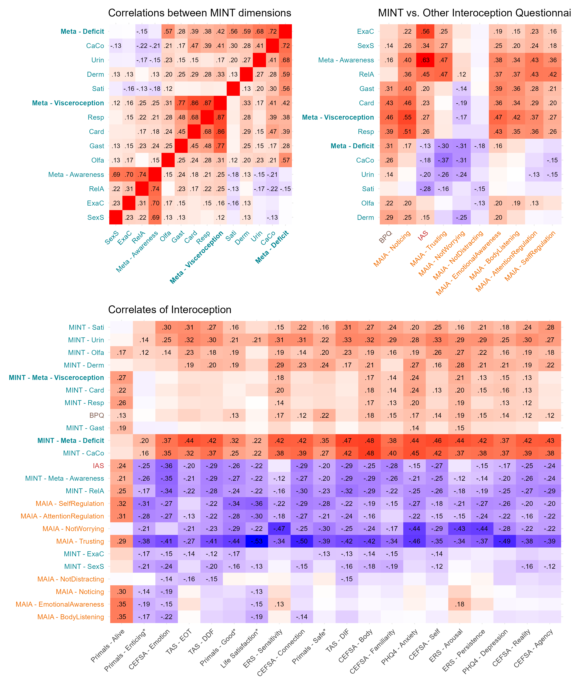
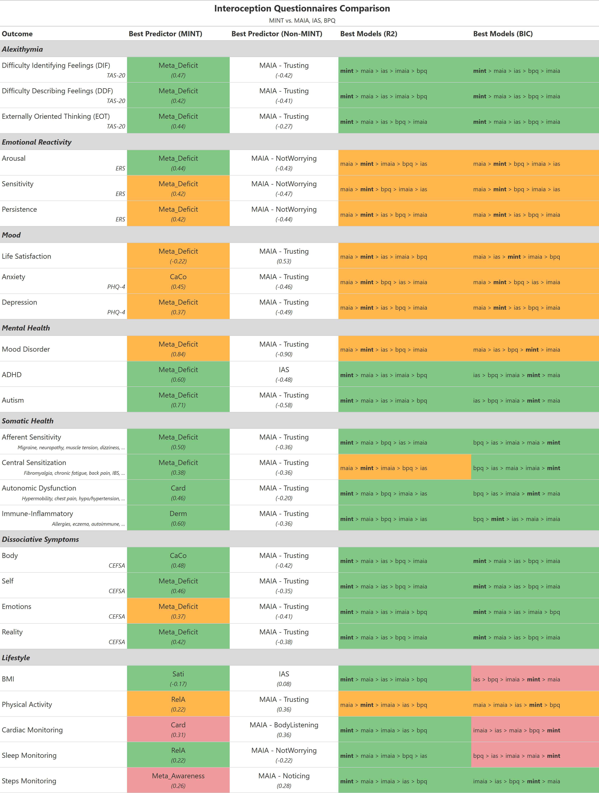
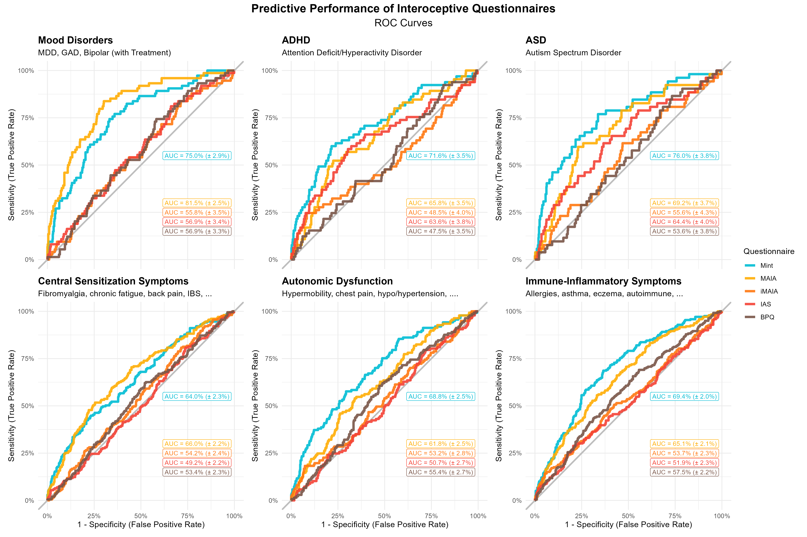

# Introduction

Interoception - the sensing and interpretation of the body's internal physiological signals - plays a fundamental role in processes ranging from homeostatic regulation to emotion, decision-making, and mental health [@craig2002how; @critchley2017interoception]. Despite its growing recognition, the field has been hindered by inconsistent definitions and fragmented measurement approaches [@khalsa2018interoception; @desmedt2025discrepancies; @desmedt2022measures]. Available tools include "objective" physiological tasks (e.g., heartbeat counting or tracking) and "subjective" self-reports, and encompass both "explicit" paradigms that direct participants' attention to internal sensations and "implicit" paradigms that do not (e.g., heartbeat evoked potentials recorded during rest). These assessments are often targeted at only one of several interoceptive modalities (e.g., cardioception, respiroception, gastroception), and are mapped onto theoretical dimensions [e.g., accuracy, sensitivity, awareness, @garfinkel2015knowing] within a rapidly evolving theoretical landscape. 

However, no consensus exists on a gold-standard measure with each approach having distinct limitations. For example, physiological tasks often require specialised equipment and expertise, are time-consuming, and are challenging to administer at scale, whereas questionnaires are constrained by their inherent subjectivity. Crucially, the psychometric quality of many of these measures is questionable [e.g., see criticism about the heartbeat counting task, @zamariola2018interoceptive], yielding low inter-task correlations [@murphy2018classifying] and raising important concerns regarding their reliability and validity (e.g., measures presented as measuring one theoretical dimension but likely measuring something else). This lack of conceptual clarity and measurement convergence impedes scientific progress in comparing, replicating, and interpreting interoception-related findings, emphasising the need to develop improved tools that align with modern psychometric standards.

<!-- There are many questionnaire measures – 14 of which are commonly used and 5 (BPQ, MAIA, BAQ, SAQ, and PBCS) which cover 86.5% of all citations of interoceptive sensibility questionnaires – Desmedt et al., 2022 -->
The present work focuses on self-report questionnaires, which offer a scalable and accessible tool complementing physiological tasks. Among the numerous interoceptive questionnaires available, a handful dominate the literature [@desmedt2022measures], including the Body Perception Questionnaire [BPQ, @kolacz2018body], **the Body Awareness Questionnaire [BAQ, @shields1989body]**, the Multidimensional Assessment of Interoceptive Awareness [MAIA, @mehling2018multidimensional], and the Interoceptive Accuracy Scale [IAS, @murphy2018classifying]. 

These tools were developed in different eras of a rapidly evolving field, each with its own objectives and philosophies. For example, the BPQ, one of the earliest measures, captures bodily awareness and autonomic nervous system (ANS) reactivity by focusing on experiences of physiological stress reactions in organs innervated by the ANS, such as those triggered by stress or trauma [@kolacz2018body]. **In contrast, the BAQ was developed to address limitations of earlier measures by assessing beliefs about one’s sensitivity to normal, non-emotive bodily processes, explicitly targeting the domain of reported awareness of normal bodily processes not typically associated with emotion or somatic complaint.** The MAIA incorporated ideas from the then-booming emotion regulation and mindfulness fields, including subscales assessing adaptive coping strategies and metacognitive insights about the body. More recently, the IAS was recently developed to circumvent these high-level - possibly tangential - constructs, instead capturing subjective reports of concrete bodily events (e.g., coughing, sneezing) as proxies for interoceptive accuracy. 

**Other questionnaires include the Body Consciousness Questionnaire [BCS, @miller1981consciousness], the  Self-Awareness Questionnaire [SAQ, @longarzo2015relationships], the Interoceptive Sensitivity and Attention Questionnaire [ISAQ , @bogaerts2022interoceptive], the Interoceptive Confusion Questionnaire [ICQ, @Brewer2016] and the Interoceptive Attention Scale [IATS, @GABRIELE2022108243]. For an extensive review of measures used in the field of interoception see @desmedt2022measures and @mehling2009body.**


These differing philosophies have practical consequences, leading to poor convergence between scales that are assumed to measure the same construct [@vig2022questionnaires] - a classic example of the "jingle fallacy" where the shared label of "interoception" can mask underlying measurand differences, hindering replication and theoretical integration. In acknowledgement of this issue, efforts have been made to align subjective measures with theoretical models that outline different facets of interoception (e.g., accuracy, attention, deficits). However, focusing on developing measures that are theory-driven may however be premature when theoretical models are in flux, and when a topographic mapping to self-report dimensions is not guaranteed. For example, interoceptive distinctions that are relevant at a neuroanatomical or cognitive level might not necessarily map onto the structure of subjective experiences, **because the body constitutes a unitary representation produced by multisensory integration of bottom-up information, with substantial influence from top-down factors [@kirsch2023role].** More fundamentally, existing interoception questionnaires typically fail to consider the full range of interoceptive modalities and the context in which interoceptive experiences occur. Most existing questionnaires focus on a narrow range of bodily modalities, with a heavy bias towards cardio-respiratory sensations at the expense of others like gastric, urogenital, or thermoregulatory signals. 

Perhaps most critically, existing measures often ask participants to make general assessments across most/all contexts, which does not capture the potential homeostatic relevance of attending or detecting internal signals. For example, the BPQ asks participants to reflect on how often during most situations a person is aware of various bodily sensations, such as their heart beating.  Without a contextual reference point, there is likely to be substantial variability in how participants interpret and respond to items as well as what those responses might mean about their interoceptive abilities.  A general item about "feeling your heart beat" is ambiguous since its salience, frequency, experience and interpretation would differ depending on the context, which may or may not be relevant homeostatically. For instance, awareness of one’s heartbeat may occur across multiple contexts, including during physical exercise, a moment of anxiety, excitement, or quiet rest with awareness across different contexts reflecting something different about interoceptive sensations. 

This is further complicated by retrospective memory biases such that individuals respond with the most easily accessible or recent instances of awareness; for example,  someone who exercises regularly, or is anxious, might more easily recall an instance of occurrence of feeling their heart beating and respond based on that contextual saliency. As an exception, the MAIA does provide some contextual cues for participants (e.g., “When something is wrong in my life I can feel it in my body”) but this is inconsistent across items and focuses almost exclusively on negative (e.g., painful) and emotional (e.g., angry, joyful) contexts as well as general ‘body’ sensations rather than specific interoceptive modalities. Thus, no existing scale captures subjective assessments across multiple interoceptive modalities and across different contexts in which interoceptive experiences occur.   


To address this gap, we developed and **assessed the Multimodal Interoception Questionnaire (Mint)**, a new questionnaire that systematically addresses the above limitations. In Study 1, we describe the development of the Mint, using a "modality-by-context" framework to generate a comprehensive item pool, which was then refined using cutting-edge psychometric network analysis.

**Network psychometrics is an emerging framework for studying relationships among psychological variables by representing them as a network structure [@epskamp2018network]. In this approach, psychological variables (e.g., traits or questionnaire items) are modelled as nodes, while the statistical relationships between them are represented as edges connecting the nodes. These edges can be weighted to reflect the strength and direction of associations between variables. Beyond descriptive modelling, network psychometrics has increasingly been applied to scale development and dimensionality assessment [@golino2017exploratory; @christensen2020psychometric; @magnavita2022development; @wongvorachan2025item]. When analysing psychological measurement data, a central question concerns whether observed variables organise into groupings that reflect underlying constructs. Within a latent variable framework, items measuring the same construct are expected to show stronger mutual associations, resulting in cohesive clusters within a network representation. Accordingly, clusters of interconnected nodes in psychometric networks have been proposed to correspond to latent variables [@golino2017exploratory].**


In Study 2, **we evaluate the final 33-item** version of the Mint against the established interoception questionnaires, demonstrating its robust structure and predictive validity for a range of clinically-relevant outcomes. 


# Study 1: Item Selection


The aim of Study 1 was to develop a new interoception questionnaire by generating a comprehensive item pool and subsequently refining it into a psychometrically robust scale. To overcome the limitations of existing questionnaires, we adopted a theoretically agnostic approach. Rather than imposing a pre-defined theoretical structure on questionnaire items, we instead focused on two tangible and systematically controllable aspects of interoceptive experience: the *modality* of the sensation and the *context* in which it occurs. Our objective was not to develop a questionnaire measuring a new or theoretically distinct facet, but instead build on existing research and synthesise existing ideas and frameworks into a comprehensive and modern tool that captures both the richness of interoceptive experiences and the most prominent facets of interoception.

**Item development proceeded through a structured process aimed at maximising consistency and breadth across interoceptive modalities and experiential contexts. Existing interoception questionnaires were first systematically reviewed to characterise the current measurement landscape, including content scope, item phrasing, and response formats. Insights from this stage, together with relevant theoretical literature and expert domain knowledge, informed the construction of a modality-by-context grid (see item generation section below), which was designed to capture and structure core principles of interoceptive experience while identifying gaps in existing measures. Items were then generated to populate each cell of this grid, using simple, first-person statements with a consistent grammatical structure. Where relevant, item wording drew inspiration from existing instruments; however, all items were newly formulated to explicitly specify both the bodily modality and the experiential context. Items were iteratively refined through internal discussion to ensure clarity, uniformity of phrasing within facets, and balanced representation across modalities and contexts. Throughout this process, redundant or ambiguous items were revised or removed, and additional items were generated where coverage was deemed insufficient. Importantly, item generation was not guided by anticipated latent dimensions or clustering, but rather by the goal of comprehensive and conceptually coherent coverage of objectively defined modalities and contexts.**

For *modalities*, we expanded beyond the typical cardio-respiratory focus to encompass a wide range of bodily systems: cardiac, respiratory, gastric, genital, bladder & colon, and skin & temperature [the latter of which being increasingly recognized as a key interoceptive channel, @crucianelli2023role]. We also included a "general state" category to capture the integrated sense of the body's overall physiological condition [@craig2002how; @craig2003interoception]. For *contexts*, we designed facets to capture specific situational contexts like negative (anxious) and positive (sexual) arousal, which reflect distinct bodily states with differing interoceptive signatures. Facets were also designed to capture other experiential qualities tapping into elaboration and threshold of perception, such as sensitivity, accuracy, and confusion. This systematic framework yielded a diverse pool of 120 initial items, ensuring comprehensive coverage while minimising the ambiguity inherent in context-free questions.

The initial pool of 120 was then reduced using cutting-edge psychometric network-based techniques, identifying and removing redundant items and revealing  the most stable and coherent dimensional structure. We also designed the study to enable an examination of structural invariance depending on presentation format (e.g., how items are grouped together, whether by modality, facet or randomly) which is an often overlooked psychometric quality. This rigorous, multi-stage process was designed to produce a subset of items with a clear, stable, and theoretically rich hierarchical structure, ready for formal validation in Study 2.

## Methods

### Participants

We recruited 760 English-speaking participants using Prolific\textcopyright. We excluded 191 for failing at least one attention check, and 10 based on measures significantly related to the probability of failing attention checks [namely, the multivariate distance obtained with the OPTICS algorithm, @theriault2024check]. The final sample includes 559 participants (age = 37.0 $\pm$ 12.2 [18, 77]; 50.8\% women, **1.07\%  non-binary**; country of residence: 63.86\% UK, 26.65\% USA,  **9.48\% other**). **Within this sample, 68.3\% identified as White, 11.3\% as Black, 5.7\% as Mixed ethnicity, and 4.1\% as South Asian, 9.3% as others and 0.7\% preferred to not disclose.**

This study was approved by the University of Sussex' Ethics Committee (ER/MB2021/1).

### Item Generation

Based on the two goals outlined for this scale, namely to include different interoceptive modalities, and to explicitly state the context of the interoceptive experience (e.g., whether negative or positive), we generated items in a systematic way following a combinatory approach, where each item's category corresponds to the union of a specific modality and context (@fig-one).


<!-- ```{r} -->
<!-- #| label: fig-one -->
<!-- #| fig-cap: "The conceptual grid used to generate the 120 initial items (top-left). Each item belongs both to an interoceptive modality (vertical) and a facet (horizontal), with the number of each item per category indicated in the circles. The asterisk denotes the additional presence of an attention check item in that category. In the experiment, these items were presented on different pages grouped either by modality (bottom-left), by facet (top-right), or randomly. The Correlation Similarity (bottom-right) analysis suggested that the correlation matrix obtained from the participants assigned to the random-grouping condition was slightly more similar (but non-significantly) to the one obtained in the modality-grouping condition, suggesting that the scale's structure is robust to different presentation conditions, and that the modality-grouping might potentially tend to facilitate the emergence of the underlying item structure (and thus be interpreted as being more \"natural\")." -->
<!-- #| fig-align: "center" -->
<!-- #| apa-twocolumn: true  # A Figure Spanning Two Columns When in Journal Mode -->
<!-- #| out-width: "100%" -->

<!--  -->
<!-- ``` -->

We identified 7 "modalities" (cardiac, respiratory, gastric, genital, skin & temperature (thermoregulation), bladder & colon, and a "general state" category corresponding to a holistic and general awareness of an interoceptive state or dimension). Through iterative refinement (e.g., splitting or merging different categories together), we settled on 6 "facets", which encompass both *contexts* of experience (negative and positive arousal, e.g., anxious and sexual states), and potential distinct *mechanisms* (nociception & pleasure, sensitivity, accuracy, and confusion). 

Using this orthogonal 7x6 modality/facet grid as a conceptual scaffolding, we generated 120 initial items, striving for a balanced number of items with consistent phrasing within modalities and facets.^[See original items at *"MASKED FOR REVIEW"*] Items were generated through conversations between the researchers/authors of this paper.
<!-- ^[The initial item list is available at [realitybending.github.io/InteroceptionScale/study1/analysis/2_analysis.html](https://realitybending.github.io/InteroceptionScale/study1/analysis/2_analysis.html)] -->
Items were generated through conversations between the reserachers/authors of these paper. 

We additionally crafted 8 "attention check" items blending in (and distributed across) each category. **These items were designed to match the grammatical structure and response format of the surrounding items,  in order to minimise their salience and reduce the risk of demand characteristics.  Each attention check explicitly instructed participants to select a specific response option (e.g., the lowest, leftmost, or rightmost point on the scale), thereby allowing us to assess whether participants were attentively reading and following item instructions (see items in green in initial item list for more information).**
 

### Procedure

To avoid presenting all the 120 items on a single long and discouraging page, we split them into different pages.
Participants were randomly assigned to one of three conditions, driving how items were grouped on the same page: 1) items grouped by modality (i.e., all cardiac items on the first page, all colon & bladder items on the second, etc.), 2) items grouped by facet, or 3) items presented fully randomly (but with their number balanced across 6 pages). The order of the item on any given page and the order of the modalities/facets was randomized.
Each participant completed the full set of 120 items, with 8 attention check items interspersed throughout.
The online experiment was implemented using JsPsych [@de2015jspsych], and item responses were recorded using 7-points Likert scales (0 = Disagree, 6 = Agree).

### Data Analysis

In order to test whether the grouping condition had an effect on the structure (i.e., how items relate to one-another), we compared the correlation matrix obtained in the random condition to the ones obtained in the modality and facet conditions, focusing on 3 indices of correlation matrix similarity - the Procrustes Similarity Index [PSI, @sibson1978studies], the Adjusted RV [Rvadj, @mayer2011exploratory], and the Similarity of Matrices Index [SMI, @indahl2018similarity]. For each index, we bootstrapped the difference between the similarity with the facet and modality conditions to test whether the correlation matrix in the random-grouping condition is significantly more similar to any of the two other conditions.

Items deemed "redundant" (which can distort the item structure estimation by introducing multicollinearity or local dependencies) were identified (using the recommended threshold of 0.25) using Unique Variable Analysis [UVA, @christensen2023unique], a novel and principled method derived from network psychometrics.

The structure of the items was analyzed using the recently-developed Exploratory Graph Analysis [EGA, @golino2017exploratory] framework, which allows to jointly estimate the number of dimensions (i.e., clusters of items), the structure, as well as its stability using bootstrapping [@golino2020investigating]. At a fundamental level, EGA conceptualizes variables as nodes in a network, with connections (edges) reflecting associations between them. 

**We selected this approach for both conceptual and methodological reasons. The item pool was intentionally heterogeneous, spanning multiple physiological domains and psychological contexts. We therefore anticipated cross-domain associations and potential correlated or partially overlapping dimensions. Traditional factor analytic models explained this covariance among items by assuming latent variables that generate shared variance. However, in complex structures characterised by high inter-factor correlations or low cross-loadings, global variance patterns can dominate, potentially biasing the estimating of the number of dimensions [@christensen2021equivalency]. In contrast, EGA estimates a network of conditional associations among items and identifies dimensions as communities of strongly connected nodes [@golino2017exploratory]. Rather than attributing associations to latent causes, this approach allows structure to emerge from patterns of direct relationships among items. This framework is particularly appropriate when constructs may reflect interacting components  (e.g., bodily sensations that co-activate across systems such as heart rate and breathing increasing at the same time) rather than purely reflective latent traits. Moreover, simulation studies indicate that EGA performs comparably to or better than traditional factor retention methods in complex and highly correlated structures [@christensen2021equivalency; @jimenez2023dimensionality].**

After removing redundant items using UVA, we iteratively fitted hierarchical EGA models (which additionally estimate higher-order "meta" clusters) using "glasso" [@friedman2008sparse] and the "Leiden" algorithm [@traag2019louvain] for community detection, refining the item pool at each step.
**We then evaluated item stability (e.g.,  extent to which items shift between clusters across bootstrapped samples). Stability ranges from 0 (no stability) to 1 (perfect stability), with values below 0.75 indicating insufficient stability [@christensen2021estimating]. Although the recommended removal threshold is $\ge$ 0.70 we applied a more conservative criterion and removed items with stability below 0.80 to preserve stronger indicators from a large initial item pool. We also removed items that did not belong to any cluster and item pairs, retaining only items from clusters with more than two items.** Finally, **within** each lower-level cluster, we selected the three items with the highest node centrality (i.e., the strongest loadings within the cluster). **To assess dimension stability, we evaluated the robustness of the identified clusters using bootstrapping, which provides indices of structural consistency (i.e., the proportion of bootstrap samples in which the original dimension is exactly replicated). High stability [e.g., >70%, @christensen2021estimating] indicates a robust dimension, whereas lower values suggest unstable, sample-dependent, or poorly defined dimensions. Lastly, we assesseed model fit using the Generalized Total Entropy Fit Index [TEFI, @Golino02112021], where higher values (i.e., values closer to zero) indicate better fit.**
**We additionally conducted an exploratory factor analysis (EFA) following the same item-removal procedure and compared the resulting structure with the EGA solution to complement the psychometric network approach with a traditional factor-analytic framework.**

For both studies, data analysis was carried out using R [4.4.3, @Rcoreteam], leveraging the *easystats* ecosystem [@ludecke2019insight; @ludecke2020extracting] and the *EGAnet* package [@christensen2021estimating]. The reproducible code and additional details are available at 
*[MASKED FOR REVIEW]*.
<!-- https://github.com/RealityBending/InteroceptionScale. -->

## Results

The correlation matrix similarity analysis yielded no significant differences between the similarity of the random-grouping condition with the modality-grouping and facet-grouping conditions ($PSI_{\text{Random vs. Facet}} = 0.81$, $PSI_{\text{Random vs. Modality}} = 0.82$, $p = .45$; $RVadj_{\text{Random vs. Facet}} = 0.77$, $RVadj_{\text{Random vs. Modality}} = 0.78$, $p = .74$; $SMI_{\text{Random vs. Facet}} = 0.49$, $SMI_{\text{Random vs. Modality}} = 0.51$, $p = .52$), despite a consistent bias in favour of the modality-grouping condition.

From the 120 initial items, 4 redundant items were flagged by UVA. We then removed 40 items that showed low cluster stability, and 9 items that were part of clusters with less than 3 items. Finally, We kept the 3 items with the highest loading in their lower-level structure (removing 13 items in the process), resulting in 54 items in the final item pool.

The final hierarchical EGA model (**TEFI** = -119.18) - in which all 54 items yielded a high cluster stability (> 90%) suggested 3 metaclusters and 15 lower-level clusters (each containing 3 items): "Interoceptive Deficits" (containing 5 clusters: *Urointestinal Inaccuracy* - UrIn; *Cardiorespiratory Confusion* - CaCo; *Cardiorespiratory Noticing* - CaNo; *Olfactory Contribution* - Olfa; *Satiety Noticing* - Sati), "Interoceptive Awareness" (containing 7 clusters: *Sexual Arousal Awareness* - SexA; *Sexual Arousal Sensitivity* - SexS; *Sexual Organs Sensitivity* - SexO; *Urointestinal Sensitivity* - UrSe; *Relaxation Awareness* - RelA; *State Specificity* - StaS; *Expulsion Accuracy* - ExAc), and "Interoceptive Sensitivity" (containing 6 clusters: *Cardioception* - Card; *Respiroception* - Resp; *Signalling* - Sign; *Gastroception* - Gast; *Dermal Hypersensitivity* - Derm; *Sexual Arousal Changes* - SexC). **Of note, the dimension stability of the higher clusters showed low structure consistency for all high-order clusters (23%-47%).**
**Within the factor-analytic framework, factor retention using oblimin rotation indicated both a 1-factor and a 17-factor solution for the original 120-item pool. The single-factor solution explained 15.67\% of the variance ($\chi^2 = 23694.21, RMSEA = 0.07 [0.06, 0.07], TLI = 0.35$), whereas the 17-factor solution showed improved fit ($\chi^2 = 14152.21, RMSEA = 0.06 [0.05, 0.06], TLI = 0.68$) and accounted for 52.23\% of the total variance, supporting a multidimensional structure. Item reduction followed the same criteria applied in the EGA, and this procedure resulted in a final set of 44 items. A subsequent factor analysis of the reduced item pool showed acceptable model fit ($\chi^2 = 1101.05, RMSEA = 0.05 [0.05, 0.06], TLI = 0.86$).**
**Overall, the EFA solution showed substantial convergence with the EGA structure, with several factors corresponding closely to clusters identified by EGA (e.g., gastric sensitivity, respiratory sensitivity, dermal hypersensitivity, urointestinal sensitivity, and sexual organ sensitivity). However, some differences emerged, particularly in the cardiorespiratory domain, where items were distributed across multiple factors in EFA rather than forming distinct clusters, and in the treatment of accuracy and confusion items, which were occasionally combined in EFA but separated in the EGA solution. Together, these results suggest that while the factor-analytic solution broadly replicated the domain structure identified by EGA, it tended to yield slightly broader factors.**

To further reduce and balance the remaining items, we collectively decided on removing the lower-level clusters *Sexual Arousal Awareness* (too general and overlapping with the other more specific sex-related items), *Signalling* (which items started with "when something important is happening in my life", which meaning we deemed too open to interpretation), and *Sexual Arousal Changes* (low fit with the other modality-focused clusters of its group). The final set included 45 items.


<!-- Interoceptive Deficits -->
<!--   C01 = "UrIn",       # Urointestinal Inaccuracy -->
<!--   C09 = "CaCo",       # Cardiorespiratory Confusion -->
<!--   C13 = "CaNo",       # Cardiorespiratory Noticing -->
<!--   C18 = "Olfa",       # Olfactory Contribution -->
<!--   C03 = "Sati",       # Satiety Noticing -->
<!-- Interoceptive Awareness -->
<!--   C04 = "SexA",       # Sexual Arousal Awareness -->
<!--   C06 = "SexS",       # Sexual Arousal Sensitivity -->
<!--   C15 = "SexO",       # Sexual Organs Sensitivity -->
<!--   C08 = "UrSe",       # Urointestinal Sensitivity -->
<!--   C10 = "RelA",       # Relaxation Awareness -->
<!--   C05 = "StaS",       # State Specificity -->
<!--   C02 = "ExAc",       # Expulsion Accuracy -->
<!-- Interoceptive Sensitivity -->
<!--   C17 = "Card",       # Cardioception -->
<!--   C14 = "Resp",       # Respiroception -->
<!--   C12 = "Sign",       # Signalling -->
<!--   C16 = "Gast",       # Gastroception -->
<!--   C11 = "Derm",       # Dermal Hypersensitivity -->
<!--   C07 = "SexC"        # Sexual Arousal Changes -->
<!-- ) -->

## Discussion

<!-- summary -->
The aim of Study 1 was to develop and refine a large, systematically generated pool of interoceptive items into a psychometrically sound and structurally coherent questionnaire. Starting with 120 items derived from a modality-by-context grid, we employed a multi-step, data-driven reduction process using cutting-edge structure analysis methods. This procedure yielded a final, balanced set of 45 items, organised within a stable hierarchical structure comprising three higher-order dimensions (Interoceptive Deficits, Interoceptive Awareness, Interoceptive Sensitivity) and 12 distinct lower-level facets.

<!-- The final reduction from 54 to 45 items was a consensus-based decision to remove three clusters for reasons of conceptual clarity and parsimony, a necessary step to ensure the final scale's usability and content validity. -->

The resulting hierarchical structure offers novel yet interpretable insights into self-reported interoception, with flexible degrees of granularity. Notably, we categorised several facets (typically related to objective external behaviours, like coughing or sneezing) under the label "Awareness". Although other questionnaires might refer to this as "Accuracy", we preferred to preserve the notion that subjective self-reports, by their very nature, cannot be a pure measure of objective accuracy and are, at best, a proxy for subjective certainty or awareness of interoceptive processes. Furthermore, our approach revealed intriguing facets, such as "Olfactory Contribution". This finding provides evidence for a pseudo-interoceptive pathway, whereby individuals with poorer access to internal signals may compensate by relying on external cues (e.g., odours) to infer their bodily state. The "Sensitivity" metacluster also grouped core visceroceptive facets (e.g., "Cardioception", "Gastroception") with "Dermal Hypersensitivity", pointing to a potential common dimension of heightened perceptual sensitivity to bodily sensations.

<!-- Effect of item presentation -->
An additional innovation of Study 1 was examining the effect of item presentation on the resulting psychometric structure by comparing structures across different grouping conditions. Although there were no significant effects of item presentation, a consistent (though non-significant) trend suggested that grouping items by modality (rather than by facet or randomly) could be more conducive to revealing the underlying psychometric structure. This finding, while preliminary due to the sample size per condition ($N \pm 200$), highlights a potentially important and under-investigated aspect of questionnaire design worthy of future research.


# Study 2: Convergent and Criterion Validity

Study 1 successfully leveraged a systematic item generation process and modern analytical techniques to produce a 45-item interoception questionnaire with a clear, stable, and theoretically rich hierarchical structure. Study 2 then sought **to examine the Mint scale psychometric properties and its relationship with existing measures in a large**, independent sample. To this end, we sought to 1) re-assess the structure of the shorter Mint version and 2) establish its convergent validity by examining correlations with other established and popular interoception questionnaires (namely the MAIA-2, BPQ, and IAS), as well as other related measures (e.g., alexithymia). Finally, we assessed the Mint’s criterion validity by directly comparing the predictive power of all interoception questionnaires across a broad range of outcomes, including emotional, cognitive, and clinical variables.
**We hypothesised that if the Interoceptive Deficit metacluster reflects difficulties recognising bodily signals, it should correlate positively with constructs reflecting impaired bodily and emotional awareness, such as alexithymia and dissociative experiences, and be elevated in conditions characterised by altered interoceptive processing (e.g., autism or ADHD). In contrast, Visceroception, capturing perceived sensitivity to cardiac, respiratory, and gastric signals, should relate more strongly to measures of bodily noticing and physiological monitoring behaviours, including the Noticing dimension of the MAIA-2. Finally, Interoceptive Awareness, which captures perceived access to specific bodily states such as relaxation or sexual arousal, should relate more strongly to measures assessing conscious awareness.**

## Methods

### Participants

We recruited 921 English-speaking participants via SONA and Prolific\textcopyright, from which 118 were excluded for failing at least one attention check and 6 based on multivariate distance (using the same procedure as for study 1). 
60 participants were further excluded due to missing data following a technical issue.
The final sample includes 737 participants (age = 36.8 $\pm$ 14.7 [18, 87]; 57.3\% women, **1.63\% non-binary**; Country of residence: 75.17% United Kingdom, 24.83% other).
**Within this sample, 80.3\% identified as White, 6.6\% as Black, 4.9\% as Mixed ethnicity, and 3.0\% as South Asian and 4.3\% as others.**

This study was approved by the University of Sussex' Ethics Committee (ER/EB672/2).


### Measures


<!-- ```{r} -->
<!-- #| label: fig-two --> -->
<!-- #| fig-cap: "Structure analysis of the final set of 33 Mint items. Hierarchical Exploratory Graph Analysis (EGA) was applied to jointly identify clusters of items, as well as higher-order metaclusters. The reliability of each item can be quantified by the proportion of structure replication across bootstrapped samples, with high values indicative of high structural stability. The Mint scale displayed an excellent structural consistency, with the exception of the *Olfa* cluster which belonging to the *Deficit* metaclusters warrants further research. Bottom plot shows the result of hierarchical clustering, providing evidence for structure statbility across methods, and allowing for more granular understanding of the relationships between variables." -->
<!-- #| fig-align: "center" --> -->
<!-- #| apa-twocolumn: true  # A Figure Spanning Two Columns When in Journal Mode --> -->
<!-- #| out-width: "80%" --> -->

<!--  --> -->
<!-- ``` -->


#### Interoception Questionnaires

The 45 items of the Multimodal Interoception Questionnaire (Mint) scale were presented in a random order, with the same 7-point Likert scale as in study 1 (0 = *Disagree*, 6 = *Agree*). **Scores should be calculated as the average of the items within each lower-order cluster. However, when a broader summary is required, average scores for the higher-order meta-clusters can be computed from the average of all their corresponding items. Correspondingly, the high-order meta-clusters of the mint showed good to excellent internal consistency: Interoceptive Awareness ($\omega$ = 0.85), Interoceptive Deficit ($\omega$ =0.74), Visceroception ($\omega$ = 0.88).**

The Multidimensional Assessment of Interoceptive Awareness [MAIA-2, @mehling2018multidimensional] measures 8 dimensions with 37 items presented on a 7-point Likert scale (0 = *Never*, 6 = *Always*). It includes bodily dimensions such as Body Listening, Noticing, Emotional Awareness, dimensions related to emotion regulation, such as Trust, Not-worrying, and Self-Regulation, as well as dimensions related to attention, such as Attention Regulation and Not-distracting. The relationship of some of these dimensions to interoception remains debated, particularly Not-Distracting and Not-Worrying, which tend to show weak or non-existent correlations with the other MAIA subscales [@ferentzi2021examining]. **The subscales of the MAIA-2 showed an acceptable to good internal consistency: $\omega$ Attention regulation = 0.87, $\omega$ Body listening = 0.76, $\omega$ Emotional awareness = 0.79, $\omega$ Not-distracting = 0.80, $\omega$ Noticing = 0.68,  $\omega$ Not-worrying = 0.79, $\omega$ Self regulation =  0.84, and $\omega$ Trusting = 0.84.**

The Body Perception Questionnaire - Very Short Form [BPQ-VSF, @cabrera2018assessing] measures a general score of bodily awareness with 12 items presented on 5-point Likert scale (0 = *Never*, 5 = *Always*). **Internal consistency for the BPQ-Awareness was good ($\omega$ = 0.91).**

The Interoceptive Accuracy Scale [IAS, @murphy2020testing] measures a general score of interoceptive accuracy to physical sensations with 21 items presented on a 5-point Likert scale (1 = *Disagree Strongly*, 5 = *Strongly Agree*). **The IAS had good internal consistency ($\omega$ = 0.88).**  

#### Emotions and Cognition

The Toronto Alexithymia Scale TAS [TAS-20, @leising2009toronto] measures 3 Alexithymia dimensions with 20 items 5-point Likert scale (1 = *Strongly Disagree*, 5 = *Strongly Agree*: Difficulty Identifying Feelings (DIF), Difficulty Describing Feelings (DDF), and Externally Oriented Thinking (EOT). **In this study, the  TAS subscales showed poor to acceptable internal consistency: $\omega$ DIF = 0.77, $\omega$ DDF = 0.53 and $\omega$ EOT = 0.69.** 

The Emotion Reactivity Scale - Brief Version [B-ERS, @veilleux2024development] measures 3 dimensions with 6 items on a 5-point Likert scale (0 = *Not like me at all*, 4 = *Extremely like me*): Arousal (*"My moods are very strong and powerful"*), Sensitivity (*"I tend to get very emotional very easily"*), and Persistence (*"When I am angry/upset, it takes me much longer than most people to calm down"*). **The subscales of the B-ERS showed acceptable to good internal consistency: $\omega$ Arousal = 0.76, $\omega$ Sensitivity = 0.90 and $\omega$ Persistence = 0.74.**

The Cognitive Emotion Regulation Questionnaire [CERQ-short, @garnefski2006cognitive] measures 9 adaptive and maladaptive emotion regulation strategies with 18 items (1 = *Almost Never*, 5 = *Almost Always*). The strategies include Self-blame ($\omega$ = 0.78), Other-blame **($\omega$ = 0.8)**, Rumination **($\omega$ = 0.61)**, Catastrophizing **($\omega$ = 0.84)**, Putting into Perspective **($\omega$ = 0.70)**, Positive Refocusing **($\omega$ = 0.80)**, Positive Reappraisal **($\omega$ = 0.75)**, Acceptance **($\omega$ = 0.75)**, and Planning **($\omega$ = 0.66)**. **The internal consistency for these dimensions ranged from acceptable to good.**

The Černis Felt Sense of Anomaly scale - short form [CEFSA-14, @vcernis2024measuring] measures 7 dissociative experiences with 14 items on a 5-point Likert scale (0 = *Never*, 4 = *Always*). This scale is designed to measure dissociative experiences in adolescence and adulthood, specifically focusing on the felt sense of anomaly-type dissociation. It includes Anomalous Experience of the Self **($\omega$ = 0.75)**, Anomalous Experience of the Body **($\omega$ = 0.77)**, Anomalous Experiences of Emotion **($\omega$ = 0.81)**, Altered Sense of Familiarity **($\omega$ = 0.72)**, Altered Sense of Connection **($\omega$ = 0.86)**, Altered Sense of Agency **($\omega$ = 0.78)**, and Altered Sense of Reality **($\omega$ = 0.58)**. The internal consistency of the subscales were mostly good with the exception of Sense of Reality. 

The Primal World Beliefs Inventory [PI-18, @clifton2021brief] measures higher-order beliefs about the basic character of the world: Good, Safe, Enticing, and Alive. The 18 items are presented on a 6-point Likert scale (0 = *Strongly Disagree*, 5 = *Strongly Agree*). **In this study, the internal consistency of the subscales were all good: $\omega$ Good = 0.84, $\omega$ Safe = 0.80, $\omega$ Enticing = 0.80 and $\omega$ Alive = 0.84.**  

#### Health and Wellbeing

The Single Item Life Satisfaction scale [SILS, @jovanovic2020longer] was followed by the PHQ-4 [@kroenke2009ultra] assessing depression and anxiety symptoms with 4 items. We used the refined version of the PHQ-4 [@makowski2025measuring], which adds an additional response option ("Once or twice"), increasing sensitivity to subclinical fluctuations. PhQ-Anxiety showed excellent reliability **($\omega$ = 0.91)** and PHQ-Depression showed good reliability **( $\omega$ = 0.84)**. 

Participants were asked to self-report any current, medically diagnosed psychiatric disorders using a checklist based on DSM-5 categories. If one or more conditions were endorsed, participants were asked to indicate any current treatments, including pharmacological (e.g., antidepressants, anxiolytics, antipsychotics, mood stabilizers), psychological (e.g., psychotherapy, mindfulness), or lifestyle interventions. Binary variables (0 = absent, 1 = present) were created to identify participants reporting mood disorders (Major Depressive Disorder, Bipolar Disorder; with a stricter subgroup of participants undergoing a pharma- or psychological treatment), anxiety-centred disorders (Generalised Anxiety Disorder, Panic Disorder, Social Anxiety Disorder, Specific Phobias), eating disorders, addiction-related disorders, borderline personality disorder, autism spectrum disorder (ASD), and ADHD.


Participants were asked to select somatic symptoms or conditions they experienced from a list of 36 options.
To facilitate mechanistic interpretation and reduce redundancy, answers were grouped into four non-overlapping clusters based on shared physiological pathways and known etiological mechanisms. The *Afferent Sensitivity* cluster included conditions associated with heightened interoceptive awareness and neurogenic excitability, such as migraine, neuropathy, dizziness, nausea, muscle tension, epilepsy, and frequent urination. The *Central Sensitization* cluster comprised syndromes characterized by chronic pain and fatigue, likely reflecting central amplification of sensory signals and HPA-axis dysregulation, such as fibromyalgia, chronic fatigue syndrome, chronic pain, back pain, pelvic pain, irritable bowel syndrome (IBS). The *Autonomic Dysfunction* cluster captured disorders linked to dysregulation of the autonomic and cardiopulmonary systems, including joint hypermobility, cardiac arrhythmia, chest pain, shortness of breath, hypo-/hypertension, sleep apnea, chronic obstructive pulmonary disease (COPD), and chronic bronchitis. Finally, the *Immune-Inflammatory* cluster encompassed conditions associated with immune dysregulation, barrier dysfunction, and gut-brain axis disturbance, such as eczema, psoriasis, skin rashes, asthma, celiac disease, gluten and lactose sensitivity, inflammatory bowel diseases (Crohn's disease and ulcerative colitis), gastroesophageal reflux disease (GERD), multiple sclerosis, and Sjögren's syndrome. 
<!-- Each symptom was assigned to a single cluster to preserve orthogonality and support subsequent analyses linking symptom profiles to interoceptive processes. -->
We scored each cluster as a binary variable based on whether the participant selected at least one symptom from that cluster. 

#### Lifestyle

Participants reported about owning any wearable devices to monitor health indices such as heart rate, number of steps, calories burned, sleep quality, and weight. For each selected device, a follow-up question inquired about the frequency of usage and subjective importance of that measure. 

Participants were asked to rate how physically active they consider themselves and how many hours of active workout they engage in per week. Participant's BMI was computed using height and weight.


### Procedure

In order to avoid the repetition of similar types of questions and balance longer and shorter questionnaires, we partitioned the measures into three groups (and randomized the order within them): 1) interoception questionnaires (MAIA, IAS, BPQ), 2) emotions (TAS, CERQ, ERS, PI-18), and 3) health (somatic symptoms, mental health, LS + PHQ-4, CEFSA). 
After completing demographic questions, participants always started with the Mint scale, and each following interoception questionnaire was interspersed with two questionnaires from the emotions and pathology groups. 7 attention checks were embedded throughout (one within each major questionnaire). **Specifically, the following items were used: “I can always accurately answer to the extreme left on this question to show that I am reading it” (Mint); “I notice that I am being asked to respond all the way to the right” (MAIA-2); “I can always accurately choose the lowest option” (IAS); “Respond all the way to the right” (BPQ-VSF); “I am able to respond all the way to the left” (TAS-20); “On the whole, I know I must press the highest option” (PI-18); and “I feel that to show I am being attentive I will press the lowest option” (CEFSA-14).**
In order to make the experiment more enjoyable, the experiment ended with a radar chart summarizing the participants' responses to the Mint scale^[The experiment can be tested by following the link on *"MASKED FOR REVIEW"*].
<!-- https://github.com/RealityBending/InteroceptionScale]. -->

<!-- ```{r} -->
<!-- #| label: fig-three -->
<!-- #| fig-cap: "Item loadings. The table shows each item of the Mint with its cluster centrality, which is the EGA equivalent (in terms of interpretation) of factor loadings. It also shows how each lower-level cluster is related to higher-order metaclusters. The lower-level clusters are Expulsion Accuracy (ExAc), Relaxation Awareness (RelA), Sexual Arousal Sensitivity (SexS), Cardiorespiratory Confusion (CaCo), Urointestinal Inaccuracy (UrIn), Dermal Hypersensitivity (Derm), Satiety Noticing (Sati), Olfactory Contribution (Olfa), Respiroception (Resp), Cardioception (Card),  Gastroception (Gast)." -->
<!-- #| fig-align: "center" -->
<!-- #| apa-twocolumn: true  # A Figure Spanning Two Columns When in Journal Mode -->
<!-- #| out-width: "100%" -->

<!--  -->
<!-- ``` -->

### Data Analysis


We started by confirming and further refining the structure of the Mint scale (see @fig-two) using the same EGA model as in Study 1. 
We then computed the lower-level dimensions and the higher-level metaclusters' scores by averaging their corresponding items.
**Descriptive statistics were calculated for each cluster, and potential demographic differences were examined using independent-samples t-tests.**
The convergent validity of the final set of items was assessed by computing the correlations between the Mint scale and the other interoception questionnaires (MAIA, BPQ, IAS).

Next, we tested the predictive power of the Mint scale relative to other interoception questionnaires.
We assessed the importance of each interoceptive dimension (from all the scales) as a unique predictor by fitting regression models (linear for continuous measures - e.g., depression score - and logistic for binary variables - e.g., presence *vs.* absence of mood disorders) to predict different outcomes, and compare the best between the 4 interoception scales based on the total explained variance [R2 or pseudo-R2 for logistic models, @ludecke2021performance].
We then evaluated the predictive performance of each scale as a whole by comparing regression models with all the dimensions entered as predictors (note that the IAS and BPQ only have one total score variable). 

We assessed the models based on their R2, as well as on the Bayesian Information Criterion (BIC), which penalizes for predictor number, thus offering a balance between model parsimony and predictive power. For the logistic models, we quantified the discriminative power by computing the Area Under the Curve (AUC) of the Receiver Operating Characteristic (ROC) curve, which assesses the model's discriminative power (the combination of sensitivity and specificity).

In order to evaluate the potential for a short version of our scale, we compared 4 variants of the Mint: the (full) *Mint* (including all lower-level dimensions), the *metaMint* (only including the metaclusters), the *miniMint* (including the metaclusters computed from a reduced number of items), and the *microMint* (including only the most representative dimension of each metacluster).
Moreover, we also included an alternative "interoception-focused" version of the MAIA (*iMAIA*) that only contains the 3 most interoceptive dimensions (Body Listening, Noticing, and Emotional Awareness)^[See correlation results to further justify this selection.]. 

## Results

The application of EGA to the initial set of 45 items reproduced the expected 14 lower-level clusters of triplets and 3 higher-order metaclusters, with the exception of the *UrSe* (Urointestinal Sensitivity), for which one item moved to the *Olfa* (Olfactory Contribution) cluster.
In order to further balance and reduce the items, we removed the *UrSe* cluster, as well as *StaS* (State Specificity), which in comparison to the other items stood out as containing vague and overlapping items
<!-- ; e.g., "Being sexually aroused is a very different bodily feeling compared to other states (e.g., feeling anxious, relaxed, or after physical exercise)" -->
; *SexO* (Sexual Organs Sensitivity), which overlapped with the *SexS* (Sexual Arousal Sensitivity) cluster; and *CaNo* (Cardiorespiratory Noticing), which overlapped with the *CaCo* (Cardiorespiratory Confusion) cluster. **Given our aim to develop a practically usable instrument and to align its length with other widely used and conceptually related measures discussed here, we considered a 45-item scale to be overly lengthy. This prompted a further evaluation of item redundancy, conceptual overlap, and face validity (e.g., Urointestinal Sensitivity items showed instability, and Sexual Organs Sensitivity items overlapped with Sexual Arousal Awareness items), leading to a reduction of the item pool to 33 items.**

The final set of 33 items yielded a good fit (**TEFI** = -77.23), with all items showing high cluster stability (> 90\%), with the exception of *Olfa*. The final structure included 11 lower-level clusters, grouped into 3 higher-order metaclusters: "Interoceptive Deficit", "Interoceptive Awareness", and "Visceroception". **Dimension stability for the lower clusters was generally very high, ranging from 100\% (SexS, Card, Gast, Resp, RelA, ExAc) to 99.2\% (Urin). Other dimensions also exhibited strong stability, with Derm and Sati at 99.6\%, RelA at 99.8\%, and CaCo at 99.4\%. Additionally, two out of the three high-order clusters showed good dimension stability (Interoceptive Awareness = 96.6\% , Visceroception = 99.4\%), while Interoceptive Deficit showed poor dimension stability (42\%). @fig-seven presents gender differences across these clusters. The largest metacluster-level difference was observed for Interoceptive Awareness, whereas the largest lower-level difference was found for Cardiorespiratory Confusion.** Item centrality (intepretable as loadings in traditional factor analysis frameworks) are shown in @fig-three. Additionally, we applied hierarchical clustering analysis which replicated this structure (see @fig-two), suggesting consistency across methods. 


<!-- ```{r} -->
<!-- #| label: fig-seven -->
<!-- #| fig-cap: "Descriptive statistics and gender differences across MINT clusters. For each cluster, mean scores and standard deviations are reported separately by gender (excluding participants identifying as “Other”), alongside independent-samples t-test results and corresponding Cohen’s d effect sizes. Statistical significance of group differences is indicated using standard thresholds (* p < .05, ** p < .01, *** p < .001)." -->
<!-- #| fig-align: "center" -->
<!-- #| apa-twocolumn: true  # A Figure Spanning Two Columns When in Journal Mode -->
<!-- #| out-width: "100%" -->


<!--  -->
<!-- ```  -->

**The "Interoceptive Awareness" cluster refers to self-perceived awareness of specific bodily states and sensations, particularly those associated with distinct physiological conditions. In the present paper, we do not conceptualise awareness as the correspondence between behavioural measures of interoceptive accuracy and metacognitive insight, as proposed in the model of @garfinkel2015knowing; instead, we use the term more broadly to refer to general bodily states representations accessible to self-report. The items in this cluster therefore capture perceived awareness of bodily states such as relaxation (RelA), sensations associated with sexual arousal (SexS), and impending expulsive events (ExAc; e.g., burping, sneezing, or flatulence), reflecting an individual’s perceived ability to recognise these bodily states. The "Interoceptive Deficit" cluster reflects difficulties, uncertainty, or inaccuracies in recognising internal bodily signals. Items in this cluster capture experiences such as confusion about cardiorespiratory sensations (CaCo), uncertainty about urinary or gastrointestinal needs (UrIn), delayed recognition of hunger or thirst (Sati), contribution of external cues such as checking body odours (Olfa), and heightened sensitivity to dermal stimulation (Derm). Finally, "Visceroception" corresponds broadly to the concept of interoceptive sensibility described in @khalsa2018interoception model as the self-reported tendency to notice internal bodily sensations. In the present scale, this construct is specifically focused on sensations arising from three major visceral systems (i.e., cardiac, respiratory, and gastric). Accordingly, items assess perceived sensitivity to changes in heart activity (Card), breathing (Resp), and stomach sensations (Gast).**

**Lastly, to complement EGA we performed factor analysis on the final set of 33 items. Factor retention was examined using FA with oblimin rotation and polychoric correlations. The optimal 2-factor solution showed poor fit ($\chi^2 = 5247.37, RMSEA = 0.12 [0.12, 0.12], TLI = 0.50$) and explained only 30\% of the variance. We therefore examined the next-best solution with nine factors, which demonstrated improved, though still suboptimal, fit ($\chi^2 = 1053.59, RMSEA = 0.06 [0.06, 0.07], TLI = 0.86$) and explained 56.88\% of the total variance. This solution comprised eight factors with three items each (Gastrioception, Sexual Sensibility, Urointestinal Inaccuracy, Dermal Hypersensitivity, Expulsion Accuracy, Olfactory Compensation, Satiety Noticing, and Relaxation Awareness) and one six-item factor combining Cardioception, Respiroception, and Cardiorespiratory Confusion. Overall, this structure closely resembled the lower-level clusters identified in the final 33-item EGA solution, with the main difference being that all cardiorespiratory items loaded onto a single factor rather than forming separate clusters.**

<!-- ```{r} -->
<!-- #| label: fig-four -->
<!-- #| fig-cap: "Correlation Matrices between the Mint dimensions (upper-left), and between the Mint and other interoception questionnaires (MAIA, BPQ and IAS; upper-right). The bottom matrix shows the relationships between interoception and other measures included in the study, such as alexithymia (TAS-20), depression and anxiety (PHQ-4), emotion reactivity (ERS), abnormal and dissociative experiences (CEFSA), and Primal World Beliefs. Stars indicate dimensions that have been score-reversed for better in-context interpretation. Correlation coefficients are shown only for significant correlations (p < .001)." -->
<!-- #| fig-align: "center" -->
<!-- #| apa-twocolumn: true  # A Figure Spanning Two Columns When in Journal Mode -->
<!-- #| out-width: "100%" -->

<!--  -->
<!-- ``` -->

### Mint

The correlation matrix of the Mint dimensions revealed an interesting and rich tapestry of relationships (see @fig-four), with contrasting patterns of associations with dimensions from the same group. For instance, *Derm* and *Olfa*, despite being positively correlated with the other dimensions from the *Deficit* cluster, 
were not negatively correlated to *Awareness* and its dimensions. Similarly, *Sati*, unlike the other *Deficit* dimensions, was not positively correlated to *Visceroception*. This complex structure suggests that the dimensions indeed capture distinct aspects of interoception, and that the metaclusters, rather than being simple aggregates of rather-redundant elements, might actually capture unique combinations (greater than the sum of their parts). It also provides evidence against a simplistic adaptive *vs.* maladaptive dichotomy, as *Deficit* was not negatively but positively correlated with *Visceroception*. Interestingly, while *Awareness* was also positively correlated with *Visceroception*, it yielded an insignificant negative correlation with *Deficit* (this finding was also aligned with the hierarchical clustering results, showing a greater proximity between *Deficit* and *Visceroception* than with *Awareness*), underlining again the complex web of relationships captured by the Mint. 

### Interoception Questionnaires

The correlation matrix between the Mint and the other interoception scales revealed high levels of overlap, as well as some unique contributions (see @fig-four).
The BPQ was positively correlated with most Mint dimensions (the highest with *Visceroception*, **$r = .46, 95\% CI = [0.40, 0.51]$**). The IAS was positively correlated with *Visceroception* and *Awareness* dimensions (the highest with *Awareness*, **$r = .63, 95\% CI = [0.58, 0.67]$**), but negatively with most *Deficit* dimensions (with the exception of *Olfa* and *Derm*). In turn, the *Visceroception* metacluster most strongly correlated with MAIA's Noticing (**$r = .55, 95\% CI = [0.50, 0.60]$**). Interestingly, MAIA's Trusting correlated selectively with *Awareness*, and negatively with *Deficit* dimensions, but not with *Visceroceptive* dimensions (underlining its high-level metacognitive nature). MAIA's Emotional Awareness and Body Listening displayed a similar pattern to Noticing, and Attention Regulation and Self Regulation positively correlated with *Awareness* and *Visceroception* dimensions, but negatively with some *Deficit* dimensions (*CaCo* and *UrIn*). Not-distracting only yielded mild negative associations with *Sati* and *Olfa*. Overall, the Mint dimensions were able to capture most of the (relevant) variance and intricacies present in the other interoception scales.

### Emotions and Cognition

Exploratory correlations with the emotion regulation (CERQ) dimensions revealed stronger associations with most of the MAIA dimensions (supporting its proximity with emotion regulation). Interestingly, Rumination (and Self-Blame) stood out as selectively related to the Mint's *Visceroception* and *Deficit* dimensions (note that Rumination was also related to the MAIA's interoceptive dimensions, namely Noticing, Emotional Awareness and Body Listening).
The only primal world belief that correlated particularly with the Mint's *Visceroception* and the MAIA's interoceptive dimension was the belief that the world was alive [i.e., the belief that the universe is conscious, purposeful, and in active relationship with oneself, @clifton2021brief].


<!-- ```{r} -->
<!-- #| label: fig-five -->
<!-- #| fig-cap: "Summary table of the comparison between interoception questionnaires (Mint, MAIA, BPQ and IAS). For various outcomes included the study, we tested the Mint and Non-Mint dimension that had the strongest link (as a unique predictor). Values in parenthesis represents correlation coefficient for continuous variables and log-odds ratios for binary variables (the occurrence of mental and somatic health conditions). We also compared the predictive performance of regression models including multiple predictors, and present their ranking based on raw predictive power (R2) and BIC, which favours more parsimonious models (with less predictors). Green background indicates an advantage for the Mint, while red backgrounds indicate an advantage for another interoception scale. Orange backgrounds indicate an advantage for the MAIA driven by its emotion-regulation dimensions (Trusting and Not-Worrying)." -->
<!-- #| fig-align: "center" -->
<!-- #| apa-twocolumn: true  # A Figure Spanning Two Columns When in Journal Mode -->
<!-- #| out-width: "82%" -->

<!--  -->
<!-- ``` -->

Most of the target outcomes measured in the study to assess validity were best predicted by one of the Mint dimension (see @fig-five).
**For example, *Deficit* was the strongest predictor for several outcomes, including Alexithymia ($R^2$ = 20–22\%), ERS’ Arousal ($R^2$ = 20\%), ADHD and Autism ($R^2$ = 3\% each), Self and Reality ($R^2$ = 21\%), and somatic symptoms ($R^2$ = 3–7\%). CaCo best predicted CEFSA’s anomalous experiences of the body ($R^2$ = 23\%), while Sati was the strongest predictor for BMI ($R^2$ = 3\%). A few outcomes were better predicted by MAIA dimensions. In particular, Not-worrying predicted ERS’ Sensitivity ($R^2$ = 22\%) and Persistence ($R^2$ = 20\%), whereas Trusting was the strongest predictor for Life Satisfaction ($R^2$ = 28\%), Depression ($R^2$ = 21\%), Anxiety ($R^2$ = 24\%), CEFSA’s Emotion ($R^2$ = 17\%) and Connection ($R^2$ = 25\%), as well as self-reported physical activity ($R^2$ = 3\%). Remaining model fits can be reviewed in the data analysis folder project's GitHub repository.**

Model comparison included 4 variants of the Mint scale, the full *Mint* (including all lower-level clusters - 33 items), the *metaMint* (including only the 3 metaclusters based on all items), the *miniMint* (including the 3 metaclusters computed from 2 of its most loading triplets - 18 items), and the *microMint* (including only the most representative dimension of each metacluster - 9 items).
This analysis confirmed the clear advantage for the Mint over the other interoception scales. The full *Mint* model was typically the best model based on R2, and the *metaMint* was the best model when parsimony was taken into account (i.e., based on BIC). Moreover, most of the instances were the *MAIA* was the best model were explainable by the inclusion of Trusting, and the interoception-only version *iMAIA* typically yielded worse performance than the Mint. In many instances, the *miniMint* yielded reasonable performance, although the *microMint* was typically less promising.

### Health, Wellbeing abd Lifestyle

The predictive performance for the mental health outcomes (see @fig-six) displayed a consistent pattern, with an advantage for the *MAIA* for depression and anxiety which dropped below the *Mint* versions for its *iMAIA* variant. The *Mint*, however, displayed a clear advantage for the prediction of autism, ADHD, and all somatic groups of symptoms (with the exception of Central Sensitization, which was best predicted by the *MAIA*).

Finally, the importance of heart monitoring (for owners of such wearable) was best predicted by MAIA's Body listening (**$r = .36, 95\% CI = [0.35, 0.68]$**), followed the *Card* dimension of the Mint (**$r = .37, 95\% CI = [0.23, 0.51]$**). The importance of sleep monitoring importance was best predicted by *RelA* (**$r = .33, 95\% CI = [0.11, 0.56]$)**, followed by MAIA's not worrying (**$r = -.219, 95\% CI = [-0.58, -0.11]$)**. Daily activity via steps monitoring was best predicted by MAIA's Noticing (**$r = .28, 95\% CI = [0.32, 0.67]$**), followed by *Awareness* (**$r = .26, 95\% CI = [0.37, 0.83]$**).


<!-- ```{r} -->
<!-- #| label: fig-six -->
<!-- #| fig-cap: "Predictive performance of interoception questionnaires for various self-reported mental health conditions (mood disorders with psychopharmacological treatment, ADHD and ASD) and somatic symptoms. The Receiver Operating Characteristic (ROC) curves are shown for the logistic regression models for various questionnaires and versions. A high Area Under the Curve (AUC) indicates a good discriminative power of the model (i.e., a strong combination of sensitivity and specificity). The Mint scale (in blue-green) consistently outperformed the other interoception scales, with the exception of the MAIA which, driven by its emotion-regulation dimensions (Trusting and Not-worrying), performed better for mood disorders and central sensitization symptoms. In several instances, the short versions of the Mint scale (miniMint and microMint) yielded reasonable performance, still outperforming other measures." -->
<!-- #| fig-align: "center" -->
<!-- #| apa-twocolumn: true  # A Figure Spanning Two Columns When in Journal Mode -->
<!-- #| out-width: "100%" -->

<!--  -->
<!-- ``` -->


## Discussion

Study 2 sought to formally **evaluate the convergent and criterion validity of the Mint** in a large, independent sample, a crucial step for establishing the psychometric soundness and unique contribution of the scale for interoception research. This involved re-assessing its structure in a new sample and establishing its convergent and criterion validity against other existing interoception questionnaires. The analysis led to a final, refined 33-item Mint scale with a stable and theoretically coherent hierarchical structure, which demonstrated substantial predictive power across a range of outcomes.

Structure re-validation is an important step following item reduction since reducing a large item pool can alter the perceived meaning and relationships between the remaining items. For instance, a questionnaire with many items suggesting abnormality or pathology might influence the interpretation of otherwise neutral items. While the original structure of the Mint was mostly replicated, the re-validation facilitated the clarification of several higher-order dimensions (e.g., the "Sensitivity" metacluster became more clearly defined around core interoceptive clusters). The final Mint structure, comprising 11 facets within 3 metaclusters, yielded excellent structural consistency and stability. The *Olfa* (Olfactory Contribution) cluster had lower stability within the *Deficit* metacluster, possibly indicative of a more complex role. For instance, this cluster could be related to adaptive compensatory processes in some participants and maladaptive strategies in others. Future studies should further investigate its place and invariance across different populations and contexts.


The criterion validity analysis revealed a clear and compelling pattern of results. The Mint scale, particularly its *Deficit* metacluster, consistently outperformed existing interoceptive scales in predicting outcomes directly related to alterations in bodily experience and self-regulation, including alexithymia, dissociative experiences, ADHD, autism, and various somatic symptoms. The MAIA-2 showed an advantage over the Mint for predicting outcomes related to general well-being (e.g., life satisfaction, depression, and anxiety). However, its predictive superiority was almost entirely driven by dimensions related to emotion regulation abilities, namely *Trusting* and *Not-Worrying*, whose inclusion as core interoceptive facets have been questioned [@ferentzi2021examining]. While valuable, the MAIA-2's most predictive subscales appear less related to core interoceptive processing and more to metacognitive beliefs about one's body and emotional coping. 

The Mint, in contrast, appears to tap more directly into distinct facets of interoceptive experience, from visceral sensitivity to perceived deficits. Indeed, when the emotion-regulation dimensions were removed (in the *iMAIA* version), the MAIA-2's predictive power for well-being outcomes dropped considerably, often below that of the Mint. Overall, for high-level, metacognitive aspects of affective state and well-being, the MAIA-2's emotion regulation facets are highly informative. For outcomes tied more specifically to bodily processes, clinical conditions characterised by sensory dysregulation, and nuanced interoceptive experiences, the Mint offers superior predictive validity and specificity.


# General Discussion

Across two studies, we developed and **assessed the convergent and criterion validity** of the Multimodal Interoception Questionnaire (Mint), a new 33-item self-report measure of interoception. Our approach addressed key limitations of existing questionnaires by starting with a systematically generated, broad item pool that explicitly accounted for context and assessed a wide range of interoceptive modalities.  The Mint is a psychometrically robust instrument with a stable, hierarchical structure comprising three higher-order metaclusters, namely *Interoceptive Deficit*, *Interoceptive Awareness*, and *Visceroception*, and 11 distinct lower-level facets. Study 2, **demonstrated that the Mint not only captures variance present in other popular scales (MAIA-2, BPQ and IAS)** but also offers superior predictive power for a range of clinical and cognitive outcomes, particularly those tied to altered bodily perception.

A key advantage of the Mint is its potential ability to disentangle core interoceptive experiences from more general emotion regulation abilities, an identified problem in interoception research where findings may be misattributed to "interoception" when they are driven by emotion regulation capacities [@murphy2020testing]. Our findings show that although the MAIA-2 is a strong predictor of general well-being, this predictive power is driven by its *Trusting* and *Not-Worrying* subscales, which heavily tap into emotion regulation skills and coping strategies. The Mint, in contrast, taps more directly into interoceptive components, and has excellent predictive power for conditions where alterations in bodily sensing are a core feature, including alexithymia, ADHD, autism, and somatic symptoms. Overall, the Mint provides a more specific measure of self-reported interoceptive processing across contexts and modalities, offering researchers a granular and comprehensive tool with which to further understand the contribution of bodily awareness to human health and disease. **In particular, the multidimensional structure of the Mint may allow future work to identify distinct interoceptive profiles, rather than assuming that individuals vary along a single continuum of interoceptive ability.**

We note several limitations that could serve as the impetus for future research efforts. First, as a self-report measure, the Mint captures subjective beliefs about interoceptive abilities, not objective accuracy. A natural next step will be to establish the extent to which subjective reports on the Mint correspond to objective interoceptive performance (e.g., heartbeat tracking tasks, heartbeat evoked potentials). Second, future research could systematically examine the usefulness of shorter versions of the Mint, for example, by investigating the tradeoffs incurred by versions with only the one or two most central facets per metacluster on psychometric qualities and predictive power. **Thirdly, although the final version of the MINT provides broader coverage of interoceptive domains than many existing alternatives, it remains non-exhaustive. In particular, several theoretically relevant content areas were not retained in the final item set, including sexual arousal state awareness, sexual arousal physiological changes (e.g., cardiac, respiratory, and thermoregulatory changes), interoceptive signalling items (e.g., noticing bodily changes during personally salient events), and pain- or illness-related interoceptive sensitivity. Future work may therefore benefit from reintroducing and refining these domains to further expand the scope of the instrument, while balancing content coverage against psychometric performance and scale length.**

**A further limitation concerns the predominantly Western, UK-based composition of the samples, which restricts the extent to which the Mint’s structure can be assumed to generalise cross-culturally, particularly given that interoceptive processes, and their cognitive elaborations, vary according to demographic factors such as gender/sex and culture [e.g.,@ma2024demographic]. For example, the Japanese validation of the MAIA-2 [@shoji2018investigating] identified a six-factor structure rather than the original eight-factor model, partly due to the removal of items from the Self-Regulation and Not-Worrying dimensions, reflecting conceptual and translation-related differences. Similarly, [@freedman2021similarities] reported that Japanese participants required greater contextual specification of items, highlighting cultural variation in how bodily experiences are interpreted. Language-related constraints have also been observed in cross-cultural scale adaptation, such as item-level ambiguities in [@lin2023psychometric] IAS validation. These findings suggest that the MINT’s metacluster organisation may partly reflect Western norms of bodily reporting. Future research should therefore formally test measurement invariance across culturally diverse samples to determine whether the identified clusters are structurally stable or culturally contingent.**

While the overall structure of the Mint is stable, some facets warrant deeper investigation. The *Olfa* (Olfactory Contribution) and *Derm* (Dermal Hypersensitivity) clusters, for instance, showed more complex patterns of association. Their placement within the *Deficit* metacluster is theoretically intriguing since the former aligns with predictive coding models of pseudo-interoception (or extero-interoception) where individuals rely on exteroceptive cues (like odours) to infer internal states [@paulus2010interoception], while the latter links visceral and cutaneous sensitivity, possibly reflecting a general trait of heightened bodily awareness or a shared mechanism of central sensitization, observed in conditions like chronic pain [@di2016alexithymia]. Future studies should examine the invariance of the Mint's structure across different populations (e.g., clinical *vs.* non-clinical groups) and contexts (e.g., heightened arousal *vs.* rest) to clarify the role of these more nuanced facets. This work could reveal whether the relevance and pattern of associations are shared or dissociable across conditions like anxiety disorders, chronic pain, and neurodevelopmental disorders.

In conclusion, the Mint scale represents a fresh take on interoception questionnaires and a significant methodological advancement for the field of interoception research. By providing a structurally coherent, nuanced tool **with strong convergent and criterion validity**, it allows for a more precise assessment of self-reported interoceptive experiences, paving the way for a deeper understanding of the multifaceted role of interoception in human psychology and pathophysiology.


# Data Availability

Data, code, and all materials are available at 
*[MASKED FOR REVIEW]*.
<!-- https://github.com/RealityBending/InteroceptionScale. -->

<!-- # Acknowledgements -->

<!-- We would like to thank Hugo Critchley for his valuable feedback on the manuscript. -->
<!-- DM would also like to thank Anastasia for the motivation provided to write this paper. -->

# References

<!-- References will auto-populate in the refs div below -->

::: {#refs}
:::


```{r}
#| label: fig-one
#| fig-cap: "The conceptual grid used to generate the 120 initial items (top-left). Each item belongs both to an interoceptive modality (vertical) and a facet (horizontal), with the number of each item per category indicated in the circles. The asterisk denotes the additional presence of an attention check item in that category. In the experiment, these items were presented on different pages grouped either by modality (bottom-left), by facet (top-right), or randomly. The Correlation Similarity (bottom-right) analysis suggested that the correlation matrix obtained from the participants assigned to the random-grouping condition was slightly more similar (but non-significantly) to the one obtained in the modality-grouping condition, suggesting that the scale's structure is robust to different presentation conditions, and that the modality-grouping might potentially tend to facilitate the emergence of the underlying item structure (and thus be interpreted as being more \"natural\")."
#| fig-align: "center"
#| apa-twocolumn: true  # A Figure Spanning Two Columns When in Journal Mode
#| out-width: "100%"


```


```{r}
#| label: fig-two
#| fig-cap: "Structure analysis of the final set of 33 Mint items. Hierarchical Exploratory Graph Analysis (EGA) was applied to jointly identify clusters of items, as well as higher-order metaclusters. The reliability of each item can be quantified by the proportion of structure replication across bootstrapped samples, with high values indicative of high structural stability. The Mint scale displayed an excellent structural consistency, with the exception of the *Olfa* cluster which belonging to the *Deficit* metaclusters warrants further research. Bottom plot shows the result of hierarchical clustering, providing evidence for structure statbility across methods, and allowing for more granular understanding of the relationships between variables."
#| fig-align: "center"
#| apa-twocolumn: true  # A Figure Spanning Two Columns When in Journal Mode
#| out-width: "80%"


```


```{r}
#| label: fig-three
#| fig-cap: "Item loadings. The table shows each item of the Mint with its cluster centrality, which is the EGA equivalent (in terms of interpretation) of factor loadings. It also shows how each lower-level cluster is related to higher-order metaclusters. The lower-level clusters are Expulsion Accuracy (ExAc), Relaxation Awareness (RelA), Sexual Arousal Sensitivity (SexS), Cardiorespiratory Confusion (CaCo), Urointestinal Inaccuracy (UrIn), Dermal Hypersensitivity (Derm), Satiety Noticing (Sati), Olfactory Contribution (Olfa), Respiroception (Resp), Cardioception (Card),  Gastroception (Gast)."
#| fig-align: "center"
#| apa-twocolumn: true  # A Figure Spanning Two Columns When in Journal Mode
#| out-width: "100%"


```


```{r}
#| label: fig-four
#| fig-cap: "Correlation Matrices between the Mint dimensions (upper-left), and between the Mint and other interoception questionnaires (MAIA, BPQ and IAS; upper-right). The bottom matrix shows the relationships between interoception and other measures included in the study, such as alexithymia (TAS-20), depression and anxiety (PHQ-4), emotion reactivity (ERS), abnormal and dissociative experiences (CEFSA), and Primal World Beliefs. Stars indicate dimensions that have been score-reversed for better in-context interpretation. Correlation coefficients are shown only for significant correlations (p < .001)."
#| fig-align: "center"
#| apa-twocolumn: true  # A Figure Spanning Two Columns When in Journal Mode
#| out-width: "100%"


```


```{r}
#| label: fig-five
#| fig-cap: "Summary table of the comparison between interoception questionnaires (Mint, MAIA, BPQ and IAS). For various outcomes included the study, we tested the Mint and Non-Mint dimension that had the strongest link (as a unique predictor). Values in parenthesis represents correlation coefficient for continuous variables and log-odds ratios for binary variables (the occurrence of mental and somatic health conditions). We also compared the predictive performance of regression models including multiple predictors, and present their ranking based on raw predictive power (R2) and BIC, which favours more parsimonious models (with less predictors). Green background indicates an advantage for the Mint, while red backgrounds indicate an advantage for another interoception scale. Orange backgrounds indicate an advantage for the MAIA driven by its emotion-regulation dimensions (Trusting and Not-Worrying)."
#| fig-align: "center"
#| apa-twocolumn: true  # A Figure Spanning Two Columns When in Journal Mode
#| out-width: "82%"


```


```{r}
#| label: fig-six
#| fig-cap: "Predictive performance of interoception questionnaires for various self-reported mental health conditions (mood disorders with psychopharmacological treatment, ADHD and ASD) and somatic symptoms. The Receiver Operating Characteristic (ROC) curves are shown for the logistic regression models for various questionnaires and versions. A high Area Under the Curve (AUC) indicates a good discriminative power of the model (i.e., a strong combination of sensitivity and specificity). The Mint scale (in blue-green) consistently outperformed the other interoception scales, with the exception of the MAIA which, driven by its emotion-regulation dimensions (Trusting and Not-worrying), performed better for mood disorders and central sensitization symptoms. In several instances, the short versions of the Mint scale (miniMint and microMint) yielded reasonable performance, still outperforming other measures."
#| fig-align: "center"
#| apa-twocolumn: true  # A Figure Spanning Two Columns When in Journal Mode
#| out-width: "100%"


```


```{r}
#| label: fig-seven
#| fig-cap: "Descriptive statistics and gender differences across MINT clusters. For each cluster, mean scores and standard deviations are reported separately by gender (excluding participants identifying as “Other”), alongside independent-samples t-test results and corresponding Cohen’s d effect sizes. Statistical significance of group differences is indicated using standard thresholds (* p < .05, ** p < .01, *** p < .001)."
#| fig-align: "center"
#| apa-twocolumn: true  # A Figure Spanning Two Columns When in Journal Mode
#| out-width: "50%"
#


```